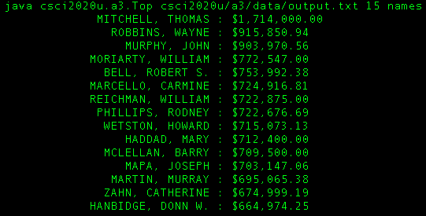

###Java.Swing application to graphically view the Sunshine List of Ontario

This project is done as an assignment for csci2020u at UOIT

See the [course site](http://leda.science.uoit.ca/teaching/sysdev/assignments/assignment3) for more details.

####Use:

The `Top` class is an executable command line tool to query the sunshine list. It sorts the list by category and prints the top results. Its use is as follows.

```
java Top <html-file> <k> <sectors|employers|positions|names>
```

with parameters:

* &lt;html-file&gt; - The location of the raw html that was pulled with getdata.py, which must be relative to the directory of execution.
* &lt;k&gt; - Include the top "k" names on the list
* &lt;sectors|employers|positions|names&gt; - The category to query

Note: The actual execution would have to include the package reference. i.e.

```
java a3.Top <html-file> <k> <sectors|employers|positions|names>
```

but this can be changes by changing everything to the default package if desired.

####Sample Output:



