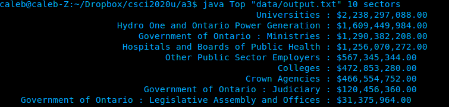
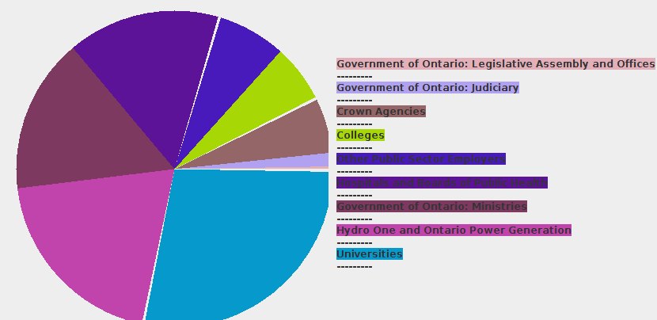
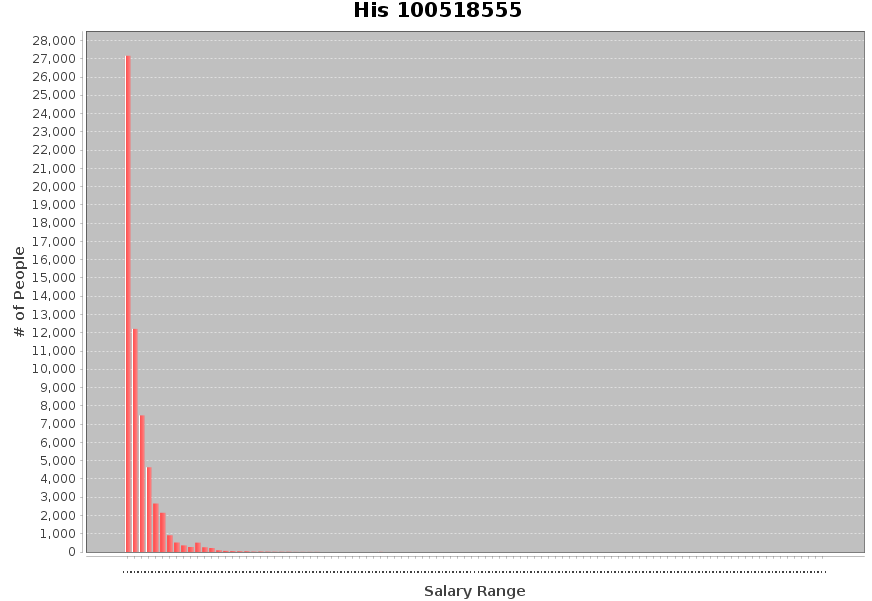
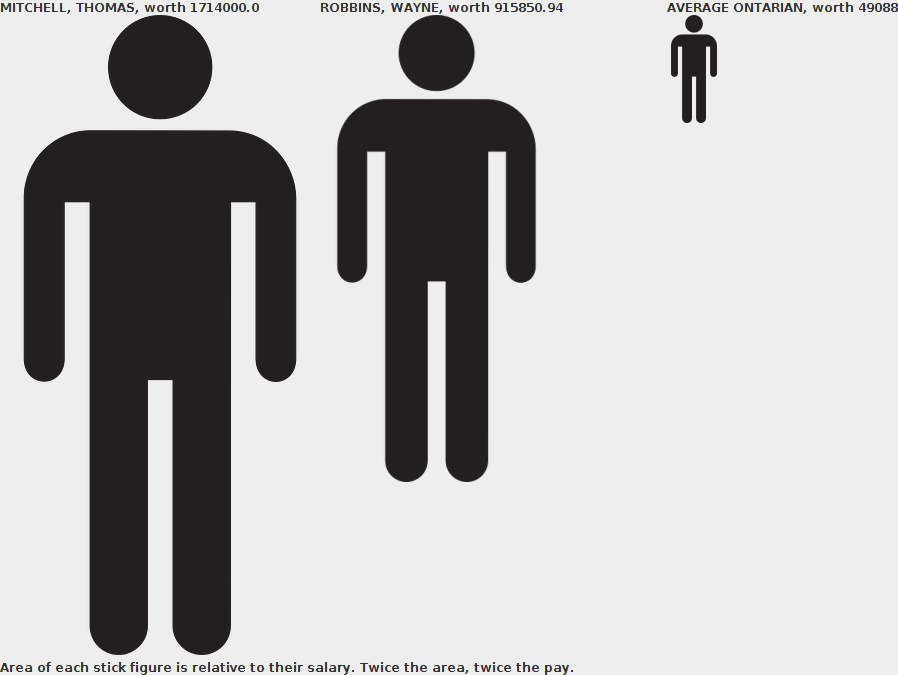

###Java.Swing application to graphically view the Sunshine List of Ontario

This project is done as an assignment for csci2020u at UOIT

Almost all of the tools in this repo require a large data file called `output.txt` to be in the data folder. However it is too large to fit in the repo. Running `getdata.py` with an internet connection will create it for you.

See the [course site](http://leda.science.uoit.ca/teaching/sysdev/assignments/assignment3) for more details.

####Compile:

Top compile everything all at once do

```
javac -cp "lib/*:." *.java
```
If you are going to compile them individually only His.java requires the library folder

###Using Top:

The `Top` class is an executable command line tool to query the sunshine list. It sorts the list by category and prints the top results. Its use is as follows.

```
java Top <html-file> <k> <sectors|employers|positions|names>
```

with parameters:

* &lt;html-file&gt; - The location of the raw html that was pulled with getdata.py, which must be relative to the directory of execution.
* &lt;k&gt; - Include the top "k" names on the list
* &lt;sectors|employers|positions|names&gt; - The category to query


####Sample Output:



###Using the Visualizations:

####Pie

```
java Pie
```

####Sample Output:



Note: Colors in the pie graph are randomized, If you don't like them, run it again.

####His

```
java -cp "lib/*:." His
```

####Sample Output:



####My

```
java My
```
Shows a stick figure of the top two earners as well as one for the average canadian salary. The area of each figure is directly proportional to their salary.

####Sample Output:



